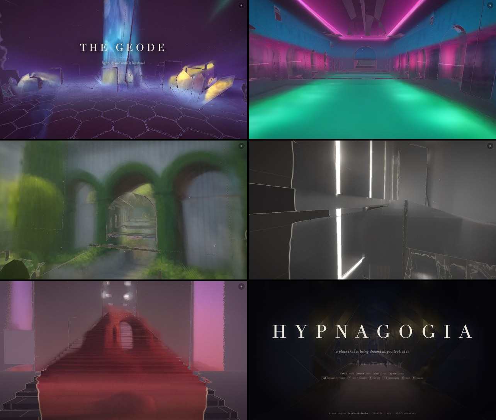

# Hypnagogia

*A place that is being dreamt as you look at it.*



A first-person walk through impossible architecture: a drowned cathedral, a library
shaft of spiral stairs, a geode, neon baths, a sunken garden under a painted sky, an
atrium of floating monoliths, a desert of two moons. What you see is painted, live, by
a diffusion model running on your own Mac.

## How it works

The usual way to put a diffusion model "in" a game is to run img2img on every frame
and show the result. That ties the game to the model's frame rate and makes every
frame a new hallucination, so it strobes.

Hypnagogia never shows a diffusion frame directly.

1. The browser renders a real 3D level with Three.js at display rate.
2. Several times a second it captures its view (color, depth, camera matrices) and
   sends the color to a local server running SD-Turbo as one-step img2img.
3. When a result comes back, the client **projects it onto the world's geometry**. It
   uses a depth test, like a shadow map, so paint only lands on surfaces the capture
   actually saw. It blends the paint into a persistent texture atlas covering every
   surface in the level.
4. The screen shows the world wearing that paint. Surfaces that haven't been dreamt
   yet show as a dark blueprint. Paint washes in as you look at them.

The paint is anchored to the world, so it doesn't swim when you turn. Each new result
only nudges the surfaces it saw, so the world slowly breathes and changes instead of
flickering. The capture sent to the model already includes the old paint, so the model
refines its own earlier dream. The game runs at 60 fps whatever the model's speed. The
model's speed only sets how fast the dream evolves.

## Speed

Measured 2026-09-28 on a Mac mini (M4 Pro, 48 GB), end to end per frame. Details and
methods are in [`bench/RESULTS.md`](bench/RESULTS.md) and
[`bench/RESULTS-coreml.md`](bench/RESULTS-coreml.md).

| Engine | Size | Frames/s |
|---|---|---|
| SD-Turbo + TAESD, stock attention (baseline) | 512² | 5.2 |
| same baseline | 384² | 8.1 |
| `torch_turbo`: MPS, ToDo attention, cross-frame DeepCache, distilled TAESD-lite | 384² | **15.7** |
| `torch_turbo` | 512² | 9.8 |
| `coreml_turbo`: SD-Turbo entirely on the Neural Engine | 512² | 11.8 |
| Whole system over Wi-Fi (browser → server → browser) | 384² | 16.4 |

The Neural Engine path leaves the GPU free for the game's own rendering. SD-Turbo is
Stability AI's model under its own license; this repo ships no model weights beyond a
316 KB distilled tiny autoencoder.

## Run it

Requires macOS on Apple Silicon, Python 3.12 via [uv](https://docs.astral.sh/uv/), and
about 3 GB for SD-Turbo weights on first run.

```bash
./run.sh                       # picks the fastest engine; http://localhost:8765
./run.sh --host 0.0.0.0        # also reachable from your phone on the same network
./run.sh --engine mock         # no model, CPU stand-in, to look around
```

Open `http://localhost:8765`, or from a phone use the LAN address that `run.sh` prints. Controls:

- Move: WASD. Look: mouse. Run: Shift. Jump: Space.
- Settings: Tab. Raw vs dreamt view: F. Forget the dream: R. Sound: M.
- Phones use touch: left thumb to move, drag to look.

To use the optional Neural Engine models, run `bench/coreml/build_models.sh 512`. It
takes a few minutes and writes about 8 GB to `~/hypnagogia-cache/coreml`.

## Before

[`legacy/`](legacy/) holds this repo's previous game, *diffused-rays* (Dec 2025),
unmodified. It is a pygame raycaster that sent whole frames through SD-Turbo. Play it
in a browser with `python legacy/web_play.py` (then open `http://localhost:8766`).

## Layout

```
client/   the game: plain ES modules, no build step (three.js vendored)
server/   aiohttp + WebSocket server, diffusion engines (torch / Core ML / mock)
bench/    engine and whole-system benchmarks, Core ML converter
docs/     DESIGN.md (architecture, protocol), screenshots
legacy/   the Dec 2025 game
```
