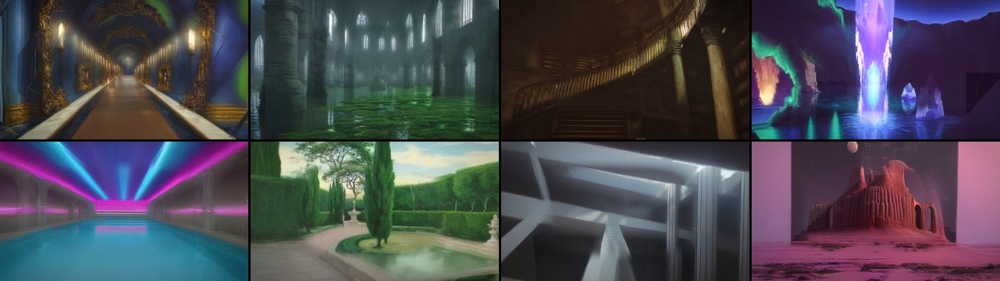

# Hypnagogia

*A place that is being dreamt as you look at it.*



A first-person walk through impossible architecture: a drowned cathedral, a library
shaft of spiral stairs, a geode, neon baths, a sunken garden under a painted sky, an
atrium of floating monoliths, a desert of two moons. What you see is painted, live, by
a diffusion model running on your own Mac.

## How it works

The usual way to put a diffusion model "in" a game is to run img2img on every frame
and show the result. That ties the game to the model's frame rate and makes every
frame a new hallucination, so it strobes.

Hypnagogia never shows a diffusion frame as a flat picture.

1. The browser renders a real 3D level with Three.js at display rate.
2. Several times a second it captures its view (color, depth, camera matrices) and
   sends the color and the depth to a local server running SD-Turbo as one-step
   img2img. The model takes the depth as an extra input (SD2-depth's difference from
   SD2-base, grafted onto SD-Turbo without training), so it paints the geometry that is
   there: a pillar stands out from the wall behind it.
3. When a result comes back, the client **projects it onto the world's geometry**. It
   uses a depth test, like a shadow map, so paint only lands on surfaces the capture
   actually saw. It blends the paint into a persistent texture atlas covering every
   surface in the level.
4. The newest few results are also projected straight onto the geometry every frame,
   from the camera that captured them, so what is in front of you shows the model's
   own pixels instead of the coarser atlas. Standing still, the view of one held framing
   follows each new result gradually (a running average), so detail doesn't boil.
5. The screen shows the world wearing that paint. Surfaces that haven't been dreamt
   yet show as a dark blueprint. Paint washes in as you look at them.

The paint is anchored to the world, so it doesn't swim when you turn. The atlas only
nudges the surfaces each result saw. Standing still, new results blend into the last
ones, and the world breathes slowly instead of flickering. The capture sent to the model
already includes the old paint; the model is refining its own earlier dream. The game
runs at display rate however fast the model is, and the model's speed only sets how fast
the dream evolves. The dream is kept in the browser, so a reload finds it where you left
it.

## Speed

Measured 2026-09-28 on a Mac mini (M4 Pro, 48 GB), end to end per frame. Details and
methods are in [`bench/RESULTS.md`](bench/RESULTS.md) and
[`bench/RESULTS-coreml.md`](bench/RESULTS-coreml.md).

Measured before the depth graft (stock UNet; the graft adds one input channel to its first
convolution and has not been timed separately):

| Engine | Size | Frames/s |
|---|---|---|
| SD-Turbo + TAESD, stock attention (baseline) | 512² | 5.2 |
| same baseline | 384² | 8.1 |
| `torch_turbo`: MPS, ToDo attention, cross-frame DeepCache, distilled TAESD-lite | 384² | **15.7** |
| `torch_turbo` | 512² | 9.8 |
| `coreml_turbo`: SD-Turbo entirely on the Neural Engine | 512² | 11.8 |
| Whole system over Wi-Fi (browser → server → browser) | 384² | 16.4 |

The client sends captures sized to its screen when the engine takes flexible sizes:
512x320 on a 16:9 screen for the 384² `torch_turbo` default: 11% more pixels and about 8%
more engine time in one bench run ([`bench/RESULTS.md`](bench/RESULTS.md)). The fixed-shape Neural Engine
path is built per capture shape: `bench/coreml/build_models.sh graft` builds the game's 512x320.

The Neural Engine path leaves the GPU free for the game's own rendering. Its `graft` build
paints with depth like `torch_turbo`, and the two can share the work
(`--engine torch_turbo,coreml_turbo --width 512 --height 320`, client `?inflight=3`): on the
mini that painted 16.5 dreams a second in the game against 11.3, but the picture shimmers
more, because only `torch_turbo` carries anything over from one frame to the next
([`docs/shots/m112/`](docs/shots/m112/)). `--engine auto` counts an engine that paints with
depth as 1.5 times faster; pass `--engine torch_turbo` to be sure. SD-Turbo and the two SD 2 UNets the depth graft is made from are Stability AI's
models under their own licenses; this repo ships no model weights beyond a 316 KB distilled
tiny autoencoder.

## Run it

Requires macOS on Apple Silicon, Python 3.12 via [uv](https://docs.astral.sh/uv/), and
about 6 GB of weights on first run: SD-Turbo (~2.6 GB) and the SD2-depth and SD2-base UNets
the depth graft is merged from (1.7 GB each).

```bash
./run.sh                       # picks the fastest engine; http://localhost:8765
./run.sh --host 0.0.0.0        # also reachable from your phone on the same network
./run.sh --engine mock         # no model, CPU stand-in, to look around
```

Open `http://localhost:8765`, or from a phone use the LAN address that `run.sh` prints. Controls:

- Move: WASD. Look: mouse. Run: Shift. Jump: Space.
- Settings: Tab. Looks (waking, drifting, lucid, fever, lens, fresh): 1-6, or the buttons at
  the top of the settings panel. Fresh gives each new view you walk into a full pass of the
  model instead of reusing the last view's deep layers: a little more detail while walking
  and nearer what you see when you stop, at a tenth to a third fewer dreams a second while
  walking (more at full walking speed). Close your eyes: hold E (or "close your eyes" in the panel); the
  room is dreamt again behind your lids and, with the depth engine, keeps its shape. Raw vs dreamt view: F. Forget the dream (also the stored
  copy): R. Sound: M.
- Phones use touch: left thumb to move, drag to look.

To use the optional Neural Engine models, run `bench/coreml/build_models.sh 512`. It
takes a few minutes and writes about 8 GB to `~/hypnagogia-cache/coreml`.

## Before

[`legacy/`](legacy/) holds this repo's previous game, *diffused-rays* (Dec 2025),
unmodified. It is a pygame raycaster that sent whole frames through SD-Turbo. Play it
in a browser with `python legacy/web_play.py` (then open `http://localhost:8766`).

## Layout

```
client/   the game: plain ES modules, no build step (three.js vendored)
server/   aiohttp + WebSocket server, diffusion engines (torch / Core ML / mock)
bench/    engine and whole-system benchmarks, Core ML converter
tools/    headless checks (Playwright): smoke test, frame-exact shots, sheets
docs/     DESIGN.md (architecture, protocol), screenshots
legacy/   the Dec 2025 game
```

## License

MIT (see [`LICENSE`](LICENSE)). Vendored three.js keeps its own MIT license
(`client/vendor/LICENSE`). No model weights are included: SD-Turbo is covered by Stability
AI's license, and SD2-depth and SD2-base (downloaded for the depth graft) by the CreativeML
Open RAIL++-M license.
